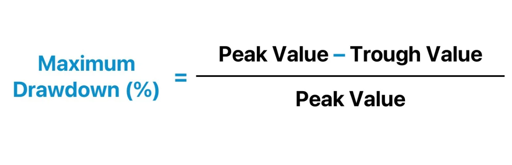

```{r message=FALSE, warning=FALSE, include=FALSE}
#install.packages("PerformanceAnalytics")
library(quantmod)
library(PerformanceAnalytics)
library(ggplot2)
library(dplyr)
library(lubridate)
library(scales)
library(plotly)
```


```{r include=FALSE}
symbols <- c("AAPL", "MSFT", "TSLA")
getSymbols(symbols, src = "yahoo", from = "2019-01-01", to = "2024-12-31")
```

# Introduction

Let’s be honest—when it comes to investing, we’ve all wondered:  

<div style="background-color:#f9f9f9; border-left:4px solid #FF6F61; padding:12px; font-style:italic; font-size:1.1em;">
Should I put all my money into one strong stock, or is it smarter to diversify and spread the risk?
</div>


<div style="margin-top:20px;"></div>

Or maybe you haven’t even asked that question yet—because you’re just getting started.


That’s exactly where this beginner-friendly analysis comes in.  
Using three of the most well-known companies—**Apple, Microsoft, and Tesla**—we’ve created a simple roadmap for anyone who’s looking to take their first steps into the stock market or just wants to better understand how it all works.


Before we dive in, let’s quickly go over how we’re calculating returns in this project. We’re using adjusted closing prices, because they reflect the real picture—they factor in things like dividends, stock splits, and other corporate changes. That way, we’re not fooled by artificial jumps or drops in price, and we can focus on what really matters: actual market movement.

From there, we calculate the daily return, which is just the change in price from one trading day to the next. It’s a simple but powerful way to track how a stock performs over time, spot volatility, and get a better sense of how efficient a portfolio really is.


```{r include=FALSE}
returns_aapl <- dailyReturn(Ad(AAPL))
returns_msft <- dailyReturn(Ad(MSFT))
returns_tsla <- dailyReturn(Ad(TSLA))
```

---


# Which Stock Has the Highest Risk?

**"When you're just starting to invest, one of the first questions you're likely to ask is: 'How risky is this stock?' Because let’s face it—risk is just as much a part of the game as reward."**

### Understanding Volatility

Volatility is a frequently encountered concept in the world of finance and holds great importance for investors.  
**But what exactly is volatility?**

Volatility refers to the degree of fluctuation in the price of a financial asset.  
In other words, it describes how quickly and significantly the price of an asset changes.

For investors, volatility can imply risk and uncertainty. However, when managed with the right strategies, it can also present opportunities.

<div style="margin-top: 1em; background-color: #f9f9f9; padding: 10px; border-left: 4px solid #007acc;">
Volatility isn't always bad — it's a sign that the market is moving. Smart investors learn how to ride those waves rather than fear them.

</div>
<div style="margin-top:20px;"></div>
<div style="background-color:#f9f9f9; padding:12px; border-left:4px solid #2196F3;">
<strong>Volatility matters</strong> because it helps investors align their portfolios with their personal risk tolerance.

</div>
<div style="margin-top:20px;"></div>

There are several ways to measure volatility, but the most common method is the calculation of **standard deviation**. Standard deviation indicates how much an asset’s return deviates from its average. A high standard deviation signifies high volatility, while a low standard deviation indicates low volatility.

Markets tend to get turbulent during uncertain times — whether it’s due to political unrest, economic shifts, natural disasters, or unexpected company news.
In such periods, stock prices can swing sharply, creating both big risks and big opportunities.

That’s why it’s important for investors to stay alert, follow the news, and adjust their portfolios if things start to move too fast or feel out of balance.

The period from 2019 to 2024 was anything but ordinary. From the COVID-19 outbreak and the vaccine rollout, to the war in Ukraine, rising inflation, and the recent AI-driven stock surge, markets have been shaped by one major event after another.

Understanding these shifts helps put volatility into perspective — because behind every price movement, there’s usually a story worth knowing.

### Visualization: Volatility Over Time


To better understand how each company reacted to key market events, we’ll take a closer look at the volatility graph. 

When we first looked into how volatility is typically measured, we noticed that many existing graphs and models appeared overly complex and hard to interpret.
To keep our analysis clear and accessible, we decided to use a simpler method — grouping adjusted daily returns into half-year periods and calculating the standard deviation for each group.

<div style="margin-top:20px;"></div>

```{r echo=FALSE}
returns_combined <- merge(returns_aapl, returns_msft, returns_tsla)
colnames(returns_combined) <- c("AAPL", "MSFT", "TSLA")
returns_df <- data.frame(Date = index(returns_combined),
                         coredata(returns_combined))
returns_df <- returns_df %>%
  mutate(HalfYear = paste0(year(Date), " H", ifelse(month(Date) <= 6, 1, 2)))

grouped_data <- returns_df %>%
  group_by(HalfYear) %>%
  summarise(across(c(AAPL, MSFT, TSLA),
                   list(Mean = ~mean(.x, na.rm = TRUE),
                        SD = ~sd(.x, na.rm = TRUE))))


```


```{r echo=FALSE}
grouped_data$HalfYear <- factor(grouped_data$HalfYear, levels = grouped_data$HalfYear)

event_labels <- data.frame(
  HalfYear = c("2020 H1", "2021 H1", "2022 H1", "2023 H1"),
  label = c("COVID", "Vaccine", "War", "AI")
)

event_lines <- lapply(event_labels$HalfYear, function(h) {
  list(
    type = "line",
    x0 = h,
    x1 = h,
    y0 = 0,
    y1 = 1,
    xref = "x",
    yref = "paper",
    line = list(color = "red", dash = "dash", width = 0.5)
  )
})
```


```{r echo=FALSE}

volatility_plot <- plot_ly(data = grouped_data) %>%
  add_trace(x = ~HalfYear, y = ~AAPL_SD, name = "AAPL", type = 'scatter', mode = 'lines+markers') %>%
  add_trace(x = ~HalfYear, y = ~MSFT_SD, name = "MSFT", type = 'scatter', mode = 'lines+markers') %>%
  add_trace(x = ~HalfYear, y = ~TSLA_SD, name = "TSLA", type = 'scatter', mode = 'lines+markers') %>%
  add_annotations(
    data = event_labels,
    x = ~HalfYear,
    y = 0,
    text = ~label,
    showarrow = FALSE,
    yanchor = "bottom",
    font = list(color = "red", size = 10)
  ) %>%
  layout(
    title = "6-Month Volatility by Stock with Key Events",
    xaxis = list(title = "Period (Half-Year)", tickangle = -45),
    yaxis = list(title = "Volatility (Standard Deviation)"),
    legend = list(title = list(text = "Stock")),
    shapes = event_lines
  )


volatility_plot


```

The results we got from the graph are pretty clear — and honestly, just what we expected.
In the first half of 2020, when COVID-19 hit, volatility for Apple, Microsoft, and Tesla spiked sharply as uncertainty flooded the markets.
Then, in early 2021, as vaccines rolled out, things began to calm down — a sign that investor confidence was coming back.

In early 2022, the Russia–Ukraine war caused another jump in volatility. But again, over time, markets adjusted, and the fluctuations began to settle.

Up until that point, all three stocks were moving in sync — reacting to major events in similar ways and then stabilizing.
But in 2023, things started to shift. With the rise of AI hype, Tesla began to stand out.
While Apple and Microsoft stayed on a smoother, more stable path, Tesla’s volatility crept up again — likely driven by speculation or excitement specific to the tech sector.

### Maximum Drawdown

While volatility tells us how much returns fluctuate, it doesn’t show how deep the losses can actually go.
That’s where Maximum Drawdown (MDD) comes in:

<div style="background-color:#fafafa; border:1px solid #ddd; padding:10px; border-radius:6px; width:450px; text-align:center; box-shadow: 1px 1px 5px rgba(0,0,0,0.05); margin: 20px auto;">
  
</div>


MDD measures the biggest drop from a peak to a trough over the entire period — in other words, the worst-case scenario an investor could have faced.

And considering how volatile Tesla has been, it wouldn’t be surprising if it also had the highest drawdown among the three stocks.

```{r include=FALSE}
# This function comes from the PerformanceAnalytics package and measures the largest loss

mdd_aapl <- maxDrawdown(returns_aapl, invert = FALSE)
mdd_msft <- maxDrawdown(returns_msft, invert = FALSE)
mdd_tsla <- maxDrawdown(returns_tsla, invert = FALSE)

<<<<<<< HEAD
SOMETHING WRONG HERE
```{r echo=FALSE}
mdd_aapl <- maxDrawdown(returns_aapl)
mdd_msft <- maxDrawdown(returns_msft)
mdd_tsla <- maxDrawdown(returns_tsla)
=======
>>>>>>> 7baa504e712ca97dc4cb8a1735459af7d2a5de61

cat("Maximum Drawdown of AAPL:", mdd_aapl, "\n")
cat("Maximum Drawdown of MSFT:", mdd_msft, "\n")
cat("Maximum Drawdown of TSLA:", mdd_tsla, "\n")
```


<table style="border-collapse: collapse; margin: 30px auto; font-size: 1em; text-align: center; box-shadow: 1px 1px 6px rgba(0,0,0,0.05); max-width: 600px;">
  <thead>
    <tr style="background-color: #f0f0f0;">
      <th style="border: 1px solid #ccc; padding: 10px 16px;">Stock</th>
      <th style="border: 1px solid #ccc; padding: 10px 16px;">Maximum Drawdown</th>
    </tr>
  </thead>
  <tbody>
    <tr>
      <td style="border: 1px solid #ccc; padding: 8px;">AAPL</td>
      <td style="border: 1px solid #ccc; padding: 8px;">-0.3143</td>
    </tr>
    <tr>
      <td style="border: 1px solid #ccc; padding: 8px;">MSFT</td>
      <td style="border: 1px solid #ccc; padding: 8px;">-0.3715</td>
    </tr>
    <tr>
      <td style="border: 1px solid #ccc; padding: 8px;">TSLA</td>
      <td style="border: 1px solid #ccc; padding: 8px;">-0.7363</td>
    </tr>
  </tbody>
</table>


The Maximum Drawdown results back up what we’ve already seen: Tesla carries a much higher level of risk.
While Apple and Microsoft saw drawdowns of about 31% and 37%, Tesla's drawdown was over 73% — a huge difference.
This means that in the worst-case scenario, Tesla investors could have lost more than two-thirds of their investment value — showing just how sensitive the stock is to major downturns.

This isn’t new for Tesla. Looking further back, one analysis shows that since 2010, Tesla has faced a 61% peak loss, while Apple never dropped more than 40% in the same period.

Yes, Tesla’s ups and downs are bigger, but that’s also part of what makes it appealing. Higher risk often comes with the chance for higher returns — and for many investors, that’s a risk worth taking.

In the following section, we’ll take a closer look at how each stock actually performed.

---

# Which Stock Had the Highest Average Return?

### Arithmetic Mean Return and Geometric Mean Return

Before diving into the results, let’s clear something up.
When it comes to measuring returns, there are two common methods: the arithmetic mean return and the geometric mean return.
Each has its own strengths and weaknesses, and choosing the right one depends on what exactly you're trying to analyze.

The arithmetic mean is calculated by adding up all daily (or annual) returns over a period and dividing the total by the number of observations.
Because it's simple and easy to interpret, it's often used for short-term performance comparisons and quick return estimates.

In this analysis, we’ll use the arithmetic mean because our focus is on comparing the average performance of each stock over specific time intervals, rather than modeling long-term compounded growth.

---

### Visualization: Average Returns Over Time

If you’ve followed along so far  great! Let’s keep going.

In the previous section, we mentioned that risk can also lead to reward. So after seeing Tesla’s extreme volatility and massive drawdowns, you might be thinking:

***"Well, with all that risk, I hope the returns are worth it!"***


Let’s find out — using the same method we applied for volatility.

<div style="margin-top:20px;"></div>


```{r echo=FALSE}

return_plot <- plot_ly(data = grouped_data) %>%
  add_trace(x = ~HalfYear, y = ~AAPL_Mean, name = "AAPL",
            type = 'scatter', mode = 'lines+markers', line = list(color = 'blue')) %>%
  add_trace(x = ~HalfYear, y = ~MSFT_Mean, name = "MSFT",
            type = 'scatter', mode = 'lines+markers', line = list(color = 'orange')) %>%
  add_trace(x = ~HalfYear, y = ~TSLA_Mean, name = "TSLA",
            type = 'scatter', mode = 'lines+markers', line = list(color = 'green')) %>%

  add_annotations(
    data = event_labels,
    x = ~HalfYear,
    y = 0,
    text = ~label,
    showarrow = FALSE,
    yanchor = "bottom",
    font = list(color = "red", size = 12)
  ) %>%

  layout(
    title = "6-Month Average Returns by Stock with Key Events",
    xaxis = list(title = "Period (Half-Year)", tickangle = -45),
    yaxis = list(title = "Average Daily Return", tickformat = ".1%"),
    legend = list(title = list(text = "Stock")),
    shapes = event_lines,
    hovermode = "x unified"
  )

return_plot


```


While Apple and Microsoft kept things relatively stable and steady throughout the period, Tesla stood out by swinging between the highest highs and the lowest lows. If you want to understand the relationship between risk and return, Tesla is the perfect example.

In the first half of 2020, as the pandemic shook the world, Tesla skyrocketed. Both its volatility and returns peaked. It was one of those moments where taking a risk really paid off.

But it didn’t always go that way. In the first half of 2022, with war and economic uncertainty in the air, Tesla was once again highly volatile — but this time, returns went negative. Same level of risk, very different outcome.

By 2023, Tesla was back on its feet. As the broader market started to recover, Tesla’s returns picked up again.

What all of this shows is simple: Volatility doesn’t just point to potential gains — it also warns us about possible losses.

<div style="background-color:#fafafa; border:1px solid #ddd; padding:10px; border-radius:6px; width:300px; text-align:center; box-shadow: 1px 1px 5px rgba(0,0,0,0.05); margin: 20px auto;">
  
</div>


<div style="background-color:#fcfcfc; border-left:3px solid #d0d0d0; padding:10px 14px; font-style:italic; font-size:1em; color:#444; margin-bottom:20px;">
  <strong>Risk</strong> can reward you... <br>
  or remind you <em>who's in charge.</em>
</div>

<p style="margin: 20px 0;">
  Alright — now that things are starting to make a bit more sense, let’s go back to the question we asked at the very beginning:
</p>

<div style="background-color:#fdfdfd; border-left:4px solid #90caf9; padding:12px 16px; font-size:1em; color:#333; margin-top:20px;">
  <em>Should I put all my money into one strong stock, or is it smarter to diversify and spread the risk?</em>
</div>

<div style="margin-top:20px;"></div>

Let’s take a closer look.

---------------------------------------

#	Does diversification reduce risk?

There is a well-known saying often attributed to economist Harry Markowitz, the father of Modern Portfolio Theory:

<div style="display: flex; align-items: center; justify-content: center; flex-wrap: wrap; gap: 20px; margin: 30px auto; max-width: 900px;">

  <!-- Left: Image -->
<div style="background-color:#fafafa; border:1px solid #ddd; padding:10px; border-radius:6px; width:200px; text-align:center; box-shadow: 1px 1px 5px rgba(0,0,0,0.05); margin: 20px auto;">
  
</div>

  <!-- Right: Quote -->
  <div style="flex: 1; min-width:250px; background-color:#fefefe; border-left:4px solid #a5d6a7; padding:14px 20px; font-style:italic; font-size:1.1em; color:#333; border-radius:6px; box-shadow:1px 1px 6px rgba(0,0,0,0.04);">
    “Diversification is the only free lunch in investing.”
</div> 

</div>


<div style="background-color:#fcfcfc; border:1px solid #ddd; border-radius:6px; padding:14px; max-width:300px; margin: 30px auto 20px auto; box-shadow:1px 1px 6px rgba(0,0,0,0.05); text-align:left;">
  
</div>

<p style="margin-top:20px;">
  Diversification means spreading investments across different assets to reduce exposure to the risk of any single investment. The basic idea is that not all assets move in the same direction at the same time. By combining assets with different risk and return profiles, investors can potentially reduce the overall risk of their portfolio while maintaining reasonable return expectations. The goal of diversification is to reduce overall volatility and achieve a more balanced return by combining assets with low correlation.
</p>

### Correlation analysis

Correlation analysis is conducted to identify which assets, when combined in a portfolio, will have a risk-reducing effect.

<div style="background-color:#fefefe; border-left:4px solid #64b5f6; padding:16px 20px; font-size:1.05em; color:#333; max-width:600px; margin: 30px auto; border-radius:6px; box-shadow:1px 1px 5px rgba(0,0,0,0.04); line-height:1.6;">
  <p style="margin: 0;"><strong>Low correlation</strong> reduces portfolio volatility.</p>
  <p style="margin: 8px 0 0 0;"><strong>High correlation</strong> increases portfolio volatility.</p>
</div>


```{r message=TRUE, include=FALSE}
prices <- merge(Cl(AAPL), Cl(TSLA), Cl(MSFT))
colnames(prices) <- c("AAPL", "TSLA", "MSFT")
returns <- na.omit(ROC(prices, type = "discrete"))
cor_matrix <- cor(returns)
print(cor_matrix)

```
Here are the correlations between stocks that we calculated with the cor() function, using daily returns derived from the ROC() function in the {TTR} package.

<table style="border-collapse: collapse; margin: 30px auto; font-size: 1em; text-align: center; box-shadow: 1px 1px 6px rgba(0,0,0,0.05); max-width: 600px;">
  <thead>
    <tr style="background-color: #f0f0f0;">
      <th style="border: 1px solid #ccc; padding: 10px 16px;"></th>
      <th style="border: 1px solid #ccc; padding: 10px 16px;">AAPL</th>
      <th style="border: 1px solid #ccc; padding: 10px 16px;">TSLA</th>
      <th style="border: 1px solid #ccc; padding: 10px 16px;">MSFT</th>
    </tr>
  </thead>
  <tbody>
    <tr>
      <th style="border: 1px solid #ccc; padding: 8px; text-align: center;">AAPL</th>
      <td style="border: 1px solid #ccc; padding: 8px;">1.0000</td>
      <td style="border: 1px solid #ccc; padding: 8px;">0.4659</td>
      <td style="border: 1px solid #ccc; padding: 8px;">0.7342</td>
    </tr>
    <tr>
      <th style="border: 1px solid #ccc; padding: 8px; text-align: center;">TSLA</th>
      <td style="border: 1px solid #ccc; padding: 8px;">0.4659</td>
      <td style="border: 1px solid #ccc; padding: 8px;">1.0000</td>
      <td style="border: 1px solid #ccc; padding: 8px;">0.4318</td>
    </tr>
    <tr>
      <th style="border: 1px solid #ccc; padding: 8px; text-align: center;">MSFT</th>
      <td style="border: 1px solid #ccc; padding: 8px;">0.7342</td>
      <td style="border: 1px solid #ccc; padding: 8px;">0.4318</td>
      <td style="border: 1px solid #ccc; padding: 8px;">1.0000</td>
    </tr>
  </tbody>
</table>


#### Proposed Portfolio 

The proposed portfolio allocation of 50% Microsoft, 30% Tesla, and 20% Apple is based on the observed correlation structure among the assets and the goal of achieving effective diversification.

Microsoft and Apple are highly correlated, which means they tend to move in the same direction. Allocating too much to both would reduce diversification benefits. Therefore, Microsoft is kept as the core low-volatility asset, while Apple’s weight is limited to avoid excessive overlap.

Tesla, on the other hand, has only moderate correlation with both Microsoft and Apple. Including Tesla at a moderate level (30%) enhances diversification and adds growth potential, without excessively increasing portfolio risk.

### Method of Comparison

#### Shape Ratio :

The Sharpe ratio is one of the most widely used methods for measuring risk-adjusted relative returns. It compares a fund's historical or projected returns relative to an investment benchmark with the historical or expected variability of such returns.

The higher the ratio, the higher the risk compensation an investment offers. Investors will therefore have a preference for investments with a high Sharpe ratio or investments that raise the entire portfolio's Sharpe ratio through diversification.

<div style="background-color:#fafafa; border:1px solid #ddd; padding:10px; border-radius:6px; width:550px; text-align:center; box-shadow: 1px 1px 5px rgba(0,0,0,0.05); margin: 20px auto;">
  
</div>


### Hypothesis

Our hypothesis is that the proposed portfolio (50% Microsoft, 30% Tesla, 20% Apple) offers a higher risk-adjusted return than both an equally weighted portfolio and any single-asset portfolio.

To test this, we will compare the Sharpe ratio of the proposed allocation against:

a random portfolio with equal weights across all three assets, and

fully concentrated portfolios consisting of only Microsoft, only Apple, or only Tesla.

These comparisons are made without relying on correlation structures, allowing us to assess whether the proposed weights themselves lead to a more efficient risk-return outcome.


```{r include=FALSE}
portfolio_sharpe <- function(weights, returns, name) {
  mean_ret <- colMeans(returns) * 252
  cov_matrix <- cov(returns) * 252
  port_return <- sum(weights * mean_ret)
  port_variance <- t(weights) %*% cov_matrix %*% weights
  port_volatility <- sqrt(port_variance)
  port_sharpe <- port_return / port_volatility
  
  cat("\n====", name, "====\n")
  cat("Sharpe Ratio: ", round(port_sharpe, 2), "\n")
}


portfolio_sharpe(c(0.50, 0.30, 0.20), returns, "Proposed Portfolio")       
portfolio_sharpe(c(0.33, 0.33, 0.33), returns, "Random Portfolio")         
portfolio_sharpe(c(0.00, 0.00, 1.00), returns, "100% Tesla")              
portfolio_sharpe(c(0.00, 1.00, 0.00), returns, "100% Apple")               
portfolio_sharpe(c(1.00, 0.00, 0.00), returns, "100% Microsoft")           


```
<table style="border-collapse: collapse; margin: 30px auto; font-size: 1em; text-align: center; box-shadow: 1px 1px 6px rgba(0,0,0,0.05); max-width: 600px;">
  <thead>
    <tr style="background-color: #f0f0f0;">
      <th style="border: 1px solid #ccc; padding: 10px 16px;">Portfolio</th>
      <th style="border: 1px solid #ccc; padding: 10px 16px;">Sharpe Ratio</th>
    </tr>
  </thead>
  <tbody>
    <tr>
      <td style="border: 1px solid #ccc; padding: 8px;">Proposed Portfolio</td>
      <td style="border: 1px solid #ccc; padding: 8px;">1.32</td>
    </tr>
    <tr>
      <td style="border: 1px solid #ccc; padding: 8px;">Evenly Split Portfolio<br><span style="font-size: 0.9em; color: #666;">(Equal weights: 33% each)</span></td>
<td style="border: 1px solid #ccc; padding: 8px;">1.30</td>
    </tr>
    <tr>
      <td style="border: 1px solid #ccc; padding: 8px;">100% Tesla</td>
      <td style="border: 1px solid #ccc; padding: 8px;">0.97</td>
    </tr>
    <tr>
      <td style="border: 1px solid #ccc; padding: 8px;">100% Apple</td>
      <td style="border: 1px solid #ccc; padding: 8px;">1.10</td>
    </tr>
    <tr>
      <td style="border: 1px solid #ccc; padding: 8px;">100% Microsoft</td>
      <td style="border: 1px solid #ccc; padding: 8px;">1.16</td>
    </tr>
  </tbody>
</table>

### Which Portfolio Performs Best? 

As expected, the proposed portfolio (50% MSFT – 30% TSLA – 20% AAPL) achieved the highest Sharpe ratio (1.32) among all compared strategies, confirming our hypothesis that this allocation provides the most efficient return relative to the risk taken.

The Evenly Split Portfolio, which distributes capital equally across all three assets without considering their risk characteristics, follows closely with a Sharpe ratio of 1.30, but falls slightly behind in efficiency.

All single-asset portfolios (100% in either Tesla, Apple, or Microsoft) perform worse in terms of risk-adjusted return:

Tesla shows the lowest Sharpe ratio (0.97) due to its high volatility and drawdown,

Apple (1.10) and Microsoft (1.16) perform better individually but lack the benefits of diversification.

These results confirm that strategic asset allocation, rather than equal weighting or concentration in a single asset, leads to better risk-adjusted performance.

### Recommendation

While the proposed portfolio (50% Microsoft, 30% Tesla, 20% Apple) achieved the highest Sharpe ratio in our analysis, it is important to emphasize that there is no universally ideal portfolio. The optimal allocation depends not only on numerical performance metrics but also on the investor's individual risk tolerance, goals, and personal preferences.

For example, an investor with a high risk appetite may reasonably prefer a higher allocation to Tesla, accepting greater volatility in exchange for potentially higher returns. In contrast, a more conservative investor might prioritize stability and allocate more heavily to Microsoft or Apple.

Therefore, we recommend that portfolio construction should not be based solely on statistical indicators such as the Sharpe ratio. Instead, investors should take into account their own investment personality, time horizon, and financial goals. Quantitative results can inform decision-making—but they should be used as a guide, not as a rule.


<<<<<<< HEAD
--------------------------------------------------------------------------------

We can prove this by calculating standard deviation both for diversified investment and single one and compare them. As we know, standard deviation considered to be a "Risk Marker", so we expect diversified portfolio to have lower standard deviation score.


```{r echo=FALSE}

portfolio_returns <- (returns_aapl + returns_msft + returns_tsla) / 3

cat("Standard Deviation of AAPL:", sd(returns_aapl), "\n")
cat("Standard Deviation of MSFT:", sd(returns_msft), "\n")
cat("Standard Deviation of TSLA:", sd(returns_tsla), "\n")
cat("Standard Deviation of Diversified Portfolio:", sd(portfolio_returns), "\n")
```
As you can see, our diversified portfolio has 2% of Standard Deviation, meanwhile, AAPL and MSFT have 1.94% and 1.83% respectively. That means 2 things. 1 - I was wrong, Standard deviation of our portfolio is higher. 2 - AAPL and MSFT itself more safe asset to have. 

Why then Mr. Markowitz was so desperate about diversification? 
And the answer is - return. Let me explain.

When we combine these three stocks into an equally weighted diversified portfolio, the portfolio’s standard deviation is 2.17%, which is lower than Tesla’s individual risk, but slightly higher than Apple’s or Microsoft’s risk.

This result demonstrates that diversification reduces the overall impact of the riskiest asset in the portfolio. Even though the portfolio still carries some risk, the extreme fluctuations of Tesla are balanced out by the relative stability of Apple and Microsoft.

Moreover, the potential return of the diversified portfolio remains attractive, since it still benefits from Tesla’s higher return potential while reducing its extreme downside risk.

Therefore, this example illustrates why diversification makes sense in practice: it helps to lower risk while preserving opportunities for higher returns.

Is simple terms, as we want our portfolio to grow, we can invest in risky assets to gain more and still consider our portfolio to be safe, using this.

Let me demonstrate it, using the following chart:


The Risk-Return Comparison chart illustrates how diversification helps to balance risk and return.

We can see that Tesla provides the highest average return (0.28%) but comes with the highest risk (4.06% standard deviation). On the other hand, Apple and Microsoft offer lower risk (around 1.8–1.9%) but also lower returns (around 0.11–0.14%).

The diversified portfolio, which combines all three stocks equally, achieves a higher return (0.18%) than Apple and Microsoft individually, while maintaining a moderate risk (2.17%), significantly lower than Tesla’s standalone risk.

This shows that diversification allows us to benefit from the growth potential of riskier assets like Tesla while keeping the overall risk at an acceptable level thanks to the stabilizing effect of safer assets like Apple and Microsoft.

In other words, diversification does not eliminate risk entirely, but it smooths the extremes, providing a more balanced and resilient portfolio that preserves the opportunity for higher returns without fully exposing the investor to the risks of any single stock.

To strengthen the analysis, we conducted two additional statistical tests:
	•	T-Test: This test was used to check whether the difference in returns between Tesla and Apple is statistically significant. The results confirmed that Tesla’s returns are not significantly higher than Apple’s, with a p-value above 0.05, supporting the conclusion that Tesla offers nearly same potential returns but at a higher risk.(Askim, please check. Maybe I calculated it wrong. It shouldn't be the same)
	
	
```{r echo=FALSE}
t_test_result <- t.test(as.vector(returns_tsla), as.vector(returns_aapl))
print(t_test_result)
```

--------------------------------------------------------------------	


	
	
--------------------------------------------------------------------	
	
	•	Linear Regression: A regression analysis between Tesla’s returns and the diversified portfolio’s returns revealed a positive relationship. This indicates that Tesla’s performance has a measurable influence on the portfolio’s overall return, contributing to both its higher return and higher volatility. This supports the idea that adding a riskier asset like Tesla can boost portfolio performance while still maintaining a balanced risk profile thanks to diversification.
	
```{r}

regression_model <- lm(returns_tsla ~ portfolio_returns)

summary(regression_model)
```

The linear regression results show a strong and statistically significant positive relationship between the returns of Tesla and the returns of the diversified portfolio.

Since the p-value is nearly 0, the probability of the result being an accident is extremely low. We can trust the result.

The coefficient of 1.65 indicates that Tesla’s returns amplify the portfolio’s movements, meaning Tesla behaves like a high-beta asset, increasing portfolio returns when the portfolio performs well, but also increasing losses when the portfolio performs poorly (higher volatility). That means that when our portfolio grows 1%, Tesla grows 1.65%.

With an R-squared of 77.8%, the model explains a large portion of Tesla’s return variability, confirming that Tesla’s performance is closely related to the portfolio’s overall dynamics. This reinforces the idea that adding Tesla to a diversified portfolio can boost returns, but it also makes the portfolio more sensitive to market movements.
⸻


=======
>>>>>>> 7baa504e712ca97dc4cb8a1735459af7d2a5de61

---
# Sources

1. **Apple vs. Tesla: Which Growth Stock to Own?** — *TheStreet*  
   <https://www.thestreet.com/apple/stock/apple-vs-tesla-which-growth-stock-to-own>

2. **Breaking Down the Geometric Mean** — *Investopedia*  
   <https://www.investopedia.com/articles/investing/071113/breaking-down-geometric-mean.asp>

3. **Testing ChatGPT: Arithmetic vs. Geometric Returns** — *TheStreet Retirement Daily*  
   <https://www.thestreet.com/retirement-daily/your-money/testing-chatgpt-arithmetic-vs-geometric-returns>

4. **Harry Markowitz and Modern Portfolio Theory** — *Corporate Finance Institute*  
   <https://corporatefinanceinstitute.com/resources/career-map/sell-side/capital-markets/harry-markowitz/>

5. **Sharpe Ratio** — *Investopedia*  
   <https://www.investopedia.com/terms/s/sharperatio.asp>

6. **Tesla-meme** — *9GAG*  
   <https://9gag.com/tag/cybertruck>


